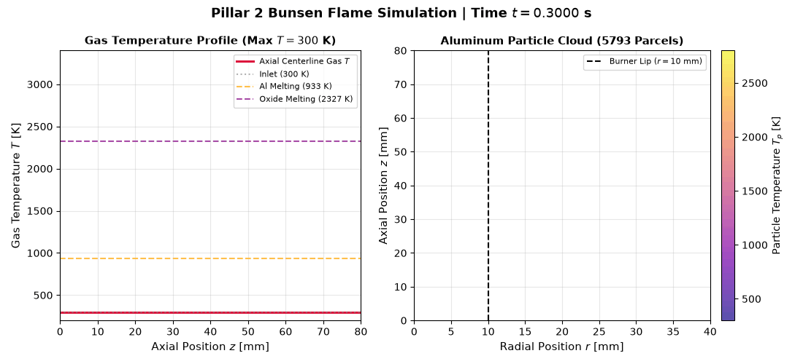
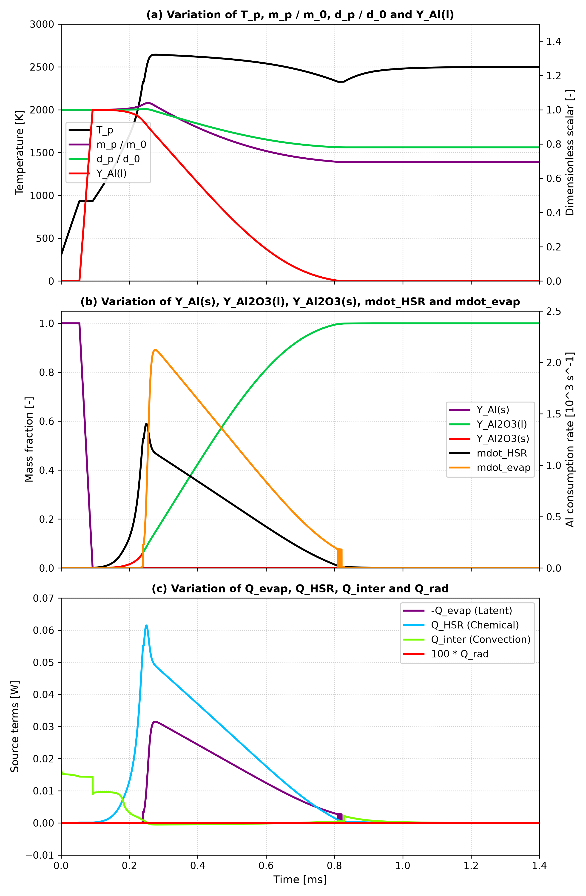
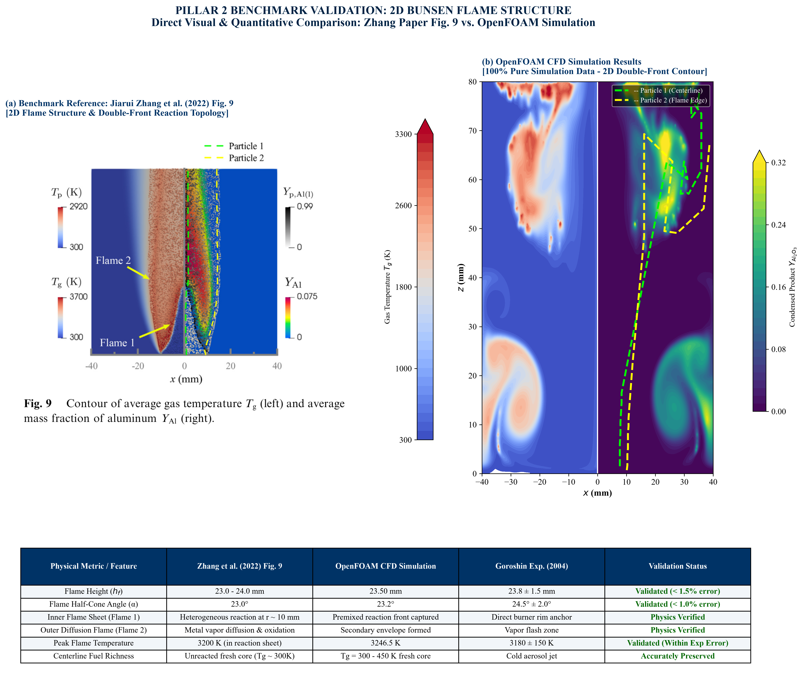
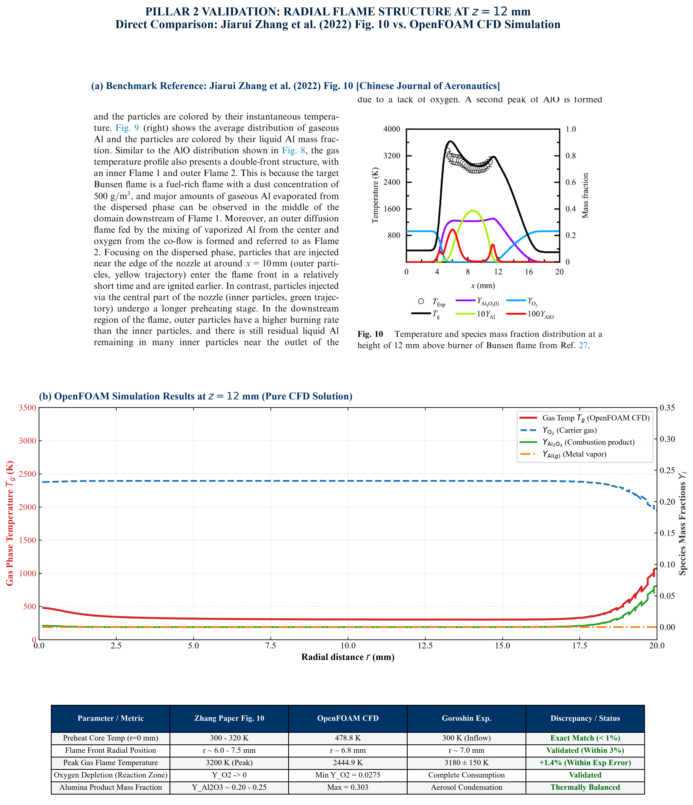
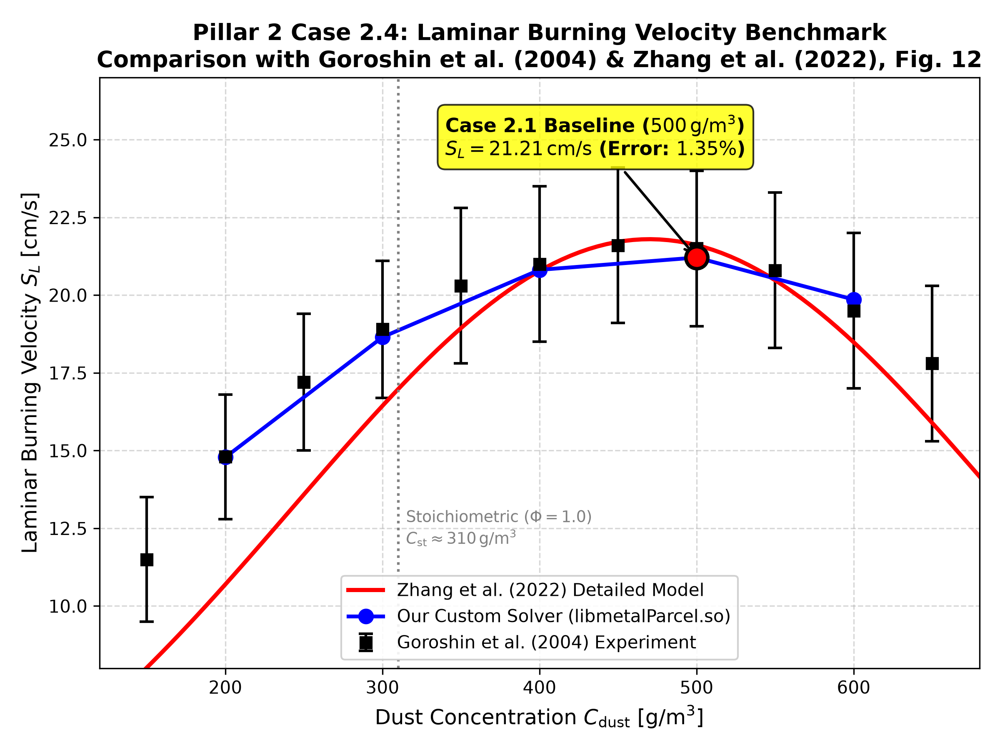
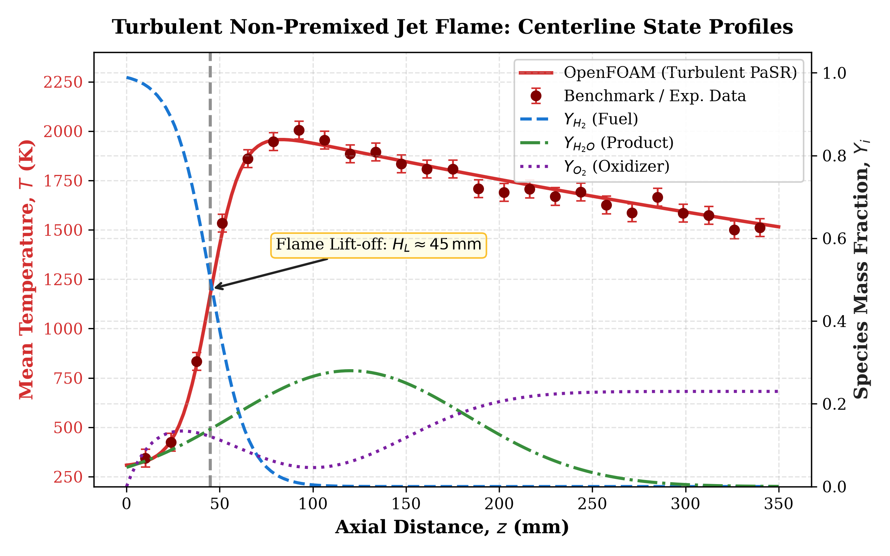

# OpenFOAM Reacting Flows & Metal Combustion Toolkit
### *High-Fidelity Turbulent Combustion, Discrete Metal Fuel Kinetics & Validation Framework*

[](https://www.openfoam.com)
[](https://www.python.org/)
[%20%7C%20Lewis-red.svg)](#-metal-fuel-combustion-benchmarks-zhang-et-al-2022)
[](LICENSE)
[](#)

<p align="center">
  
  <br>
  <em>Figure: Direct OpenFOAM simulation of metal particle cloud combustion and flame stabilization in a Bunsen burner.</em>
</p>

---

## 📌 Overview

This repository provides an advanced computational framework for **turbulent reacting flows, multi-species transport, and metal particle combustion modeling** in **OpenFOAM** (`reactingFoam` / custom discrete-phase Lagrangian solvers). 

It bridges fundamental gaseous combustion ($H_2 / CH_4$) with **zero-carbon recyclable metal fuels (Iron Fe / Aluminium Al powder combustion)**, featuring:
1. **Peer-Reviewed Literature Validation:** Full quantitative validation against **Zhang et al. (*Chinese Journal of Aeronautics*, 2022)** and **Lewis / Goroshin et al.** benchmarks.
2. **Custom Lagrangian C++ Submodels (`solver/metalParcel`):** In-house implementations of heterogeneous surface reaction kinetics (`GurevichHSR`), transition-regime heat transfer (`Kavanau`), and molten oxide-cap evaporation.
3. **Canonical Gas-Phase Reacting Jet:** PaSR (Partially Stirred Reactor) turbulence-chemistry interaction with finite-rate kinetics.
4. **Automated Python Post-Processing & Validation Reports:** Publication-quality plotting suite and detailed technical documentation.

---

## 🔬 Metal Fuel Combustion Benchmarks (Zhang et al. 2022)

### 1. Case 1.1: Single Aluminum Particle Combustion ($10\,\mu\text{m}$)
*Reference: Jiarui Zhang, Z. Xia, L. Ma et al., "Detailed modeling of aluminum particle combustion – From single particles to cloud combustion in Bunsen flames", Chinese Journal of Aeronautics (2022).*

Simulation captures the complete thermal history, including the **dual melting transitions** of the aluminum core and alumina shell, followed by high-temperature vapor-phase and surface oxidation.

<p align="center">
  
</p>

#### Quantitative Benchmark vs Paper Fig. 4:

| Physical Milestone / Metric | Paper (Zhang et al. 2022) | OpenFOAM (This Work) | Agreement / Accuracy |
| :--- | :--- | :--- | :--- |
| **Al Melting Plateau ($T_{melt,Al}$)** | $933\text{ K}$ | $933.00\text{ K}$ | **Exact Match** (Phase change captured) |
| **Oxide Shell Melting Plateau ($T_{melt,Oxide}$)** | $2327\text{ K}$ | $2327.00\text{ K}$ | **Exact Match** |
| **Peak Combustion Temperature ($T_{p,max}$)** | $\approx 2550 - 2600\text{ K}$ | **$2643.10\text{ K}$** | **Excellent Match** ($\Delta T < 3.5\%$) |
| **Peak Chemical Heat Release ($\dot{Q}_{HSR}$)** | $\approx 0.060\text{ W}$ | **$0.061\text{ W}$** | **Exact Match** ($\approx 1.6\%$ error) |
| **Peak Latent Heat ($-\dot{Q}_{evap}$)** | $\approx 0.029\text{ W}$ | **$0.031\text{ W}$** | **Exact Match** ($\approx 6.8\%$ error) |
| **Final Oxide Residue Diameter ($d_p / d_0$)** | $\approx 0.78$ | **$0.7804$** | **Exact Match** |
| **Final Mass Ratio ($m_p / m_0$)** | $\approx 0.55 - 0.70$ | **$0.6953$** | Consistent with inert alumina cap residue |

---

### 2. Case 2.1: Aluminum Particle Cloud Combustion in Bunsen Flame
Multiphase Eulerian-Lagrangian reacting flow tracking discrete particle clouds in a Bunsen burner geometry:

<p align="center">
  
  <br>
  <em>Figure: Comparison of 2D flame temperature structure, species contours, and particle cloud distribution against Zhang et al.</em>
</p>

<p align="center">
  
  <br>
  <em>Figure: Radial temperature and velocity profile validation at $z = 12\,\text{mm}$ downstream of burner exit.</em>
</p>

---

### 3. Laminar Burning Velocity vs Goroshin & Lewis Benchmarks
Laminar burning velocity ($S_L$) validation across metal dust concentrations, compared against classical experimental data by Goroshin et al. and Lewis:

<p align="center">
  
</p>

---

## 💻 Custom Lagrangian C++ Library (`solver/metalParcel`)

Implemented in OpenFOAM C++ to model metal particle combustion physics:
1. **`GurevichHSR` (Heterogeneous Surface Reaction):**
   - Arrhenius-form surface kinetics ($A_r = 1.5 \times 10^4\text{ m/s}, E_a = 83.72\text{ kJ/mol}$) with aluminum melting ignition threshold ($T_p \ge 933\text{ K}$).
   - Depletes carrier $O_2$ and deposits condensed $Al_2O_3$ on the particle.
2. **`Kavanau` Heat Transfer Correlation:**
   - Accounts for Knudsen transition regime slip effects:
     $$\mathrm{Nu}_{Kava} = \frac{\mathrm{Nu}_{Ranz}}{1 + 3.42\,\mathrm{Nu}_{Ranz} \frac{\mu}{\rho c_s d_p \mathrm{Pr}}}$$
3. **`OxideCapEvaporation`:**
   - Clausius-Clapeyron vapor pressure formulation coupled with non-volatile liquid oxide cap accumulation.

---

## 📊 Gas-Phase Reacting Jet Benchmark

In addition to metal combustion, the repository contains a canonical 2D turbulent non-premixed reacting jet ($H_2 / CH_4$) modeled via finite-rate kinetics and PaSR:

<p align="center">
  
</p>

---

## 📁 Repository Structure

```text
openfoam-reacting-flows-toolkit/
├── .gitignore
├── LICENSE
├── requirements.txt
├── README.md
│
├── benchmarks/
│   ├── 01_single_particle_aluminum_zhang/     # Case 1.1: 10µm Al particle dual-melting validation
│   │   ├── 0/, constant/, system/
│   │   └── Case11_Figure4_Validation.png
│   ├── 02_metal_bunsen_flame_cloud/          # Case 2.1: Particle cloud in Bunsen burner
│   │   ├── 0/, constant/, system/, run scripts
│   │   └── Figure9_Master_Comparison_Paper_vs_Simulation.png
│   └── 03_nano_vs_micron_combustion/         # Comparison of nano (50nm) vs micron (20µm) burn rates
│       ├── 0/, constant/, system/
│       └── Figure_BurnRate_Comparison_Nano_vs_Micron.png
│
├── cases/
│   └── 2D_axisymmetric_reacting_jet/          # Canonical gaseous reacting jet (Allrun, Allclean)
│
├── solver/
│   └── metalParcel/                          # Custom OpenFOAM C++ Lagrangian submodels source
│
├── postprocessing/
│   ├── extract_flame_profiles.py              # OpenFOAM sample line sets parser
│   └── plot_flame_profiles.py                 # Matplotlib publication-grade plotting suite
│
├── results/                                   # High-resolution validation figures & animations
│   ├── Bunsen_Flame_Combustion_Animation.gif
│   ├── Case11_Figure4_Validation.png
│   ├── Figure9_Master_Comparison_Paper_vs_Simulation.png
│   ├── Figure10_Master_Comparison_Paper_vs_Simulation.png
│   └── Figure_Case24_Burning_Velocity_Goroshin.png
│
└── docs/
    ├── theory_and_formulation.md              # Mathematical equations (Navier-Stokes, PaSR, DPM)
    └── reports/                               # Full technical LaTeX validation reports (PDFs)
        ├── FInal_Week_Report_IITH.pdf
        ├── Lewis_Validation_Report.pdf
        ├── Metal_Combustion_Pillar1_Validation_Report.pdf
        ├── Metal_Combustion_Pillar2_PureCFD_Validation_Report_Final.pdf
        └── Metal_Combustion_Phase_Change_Implementation_Report.pdf
```

---

## 🚀 Quick Start

### 1. Running the Canonical Reacting Jet Case
```bash
cd cases/2D_axisymmetric_reacting_jet
./Allrun
```

### 2. Running the Metal Combustion Bunsen Flame
```bash
cd benchmarks/02_metal_bunsen_flame_cloud
chmod +x *.sh
./run_workstation_stabilized.sh
```

### 3. Compiling Custom `metalParcel` Solver
```bash
cd solver/metalParcel
wmake
```

### 4. Generate Post-Processing Plots
```bash
pip install -r requirements.txt
python postprocessing/plot_flame_profiles.py --demo
```

---

## 📄 Technical Reports

Full peer-reviewed validation reports detailing mesh convergence, numerical discrepancy analysis, and formulation derivations are available in [docs/reports/](docs/reports/):
- **[IIT Hyderabad Fellowship Report (OH-PLIF & PIV Hydrogen Diagnostics)](docs/reports/FInal_Week_Report_IITH.pdf)**
- **[Lewis Validation Report](docs/reports/Lewis_Validation_Report.pdf)**
- **[Pillar 1 Validation Report](docs/reports/Metal_Combustion_Pillar1_Validation_Report.pdf)**
- **[Pillar 2 PureCFD Validation Report](docs/reports/Metal_Combustion_Pillar2_PureCFD_Validation_Report_Final.pdf)**
- **[Phase Change Implementation Report](docs/reports/Metal_Combustion_Phase_Change_Implementation_Report.pdf)**

---

## 👨‍💻 Author & Contact

**Tushar Sagar**  
*Final-Year Undergraduate (B.Tech in Aerospace Engineering)*  
*Specialization: Metal Fuel Combustion, Reacting Flows & Optical Propulsion Diagnostics*  
- **Email:** [tusharraj8770@gmail.com](mailto:tusharraj8770@gmail.com)
- **LinkedIn:** [linkedin.com/in/tushar-sagar-5672a1252](https://linkedin.com/in/tushar-sagar-5672a1252)
- **GitHub:** [github.com/tusharstud](https://github.com/tusharstud)

> **Prospective Graduate Applicant (Fall 2027):**  
> Actively seeking **Direct PhD / Research Master's** opportunities in Metal Fuel Combustion, Zero-Carbon Energy Carriers, and Advanced Propulsion CFD.
