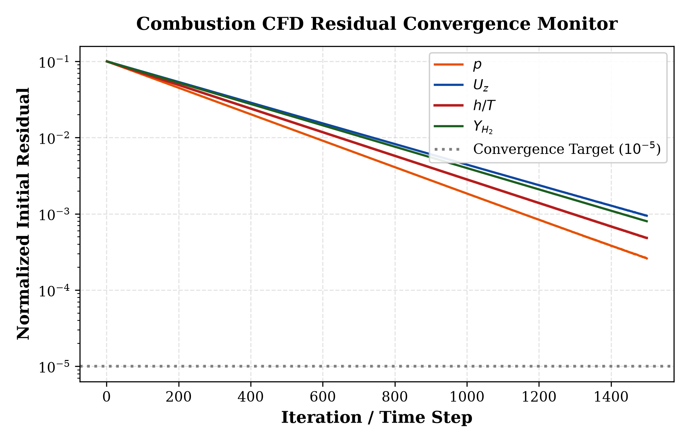

# OpenFOAM Reacting Flows Toolkit
### *High-Fidelity Turbulent Combustion Simulation & Automated Post-Processing Engine*

[](https://www.openfoam.com)
[](https://www.python.org/)
[](LICENSE)
[](#)

---

## 📌 Overview

This repository provides an automated computational framework for **turbulent reacting flows, multi-species transport, and combustion diagnostics** utilizing the open-source CFD package **OpenFOAM** (`reactingFoam` / `rhoReactingFoam`). 

It integrates:
- **Canonical Benchmark Case Setups:** Mesh generation, initial/boundary condition formulations, and finite-rate chemical kinetics.
- **Turbulence-Chemistry Interaction (TCI):** Partially Stirred Reactor (**PaSR**) modeling coupled with stiff ODE chemistry integration.
- **Automated Python Post-Processing:** Automated extraction of centerline profiles, species mass fractions, flame lift-off height ($H_L$), and residual convergence monitoring.
- **Multiphase & Metal Combustion Formulations:** Foundations for Eulerian-Lagrangian discrete phase modeling (DPM) applicable to zero-carbon recyclable metal fuels (e.g., Iron/Aluminium powder combustion) and solid propulsion systems.

---

## 📊 Validation & Benchmark Results

The toolkit includes an automated post-processing engine producing publication-ready visualizations directly from OpenFOAM line samples and probe dictionaries.

### 1. Centerline Flame Profiles ($T$ & Key Species $Y_i$)
Axial temperature distribution and species decay ($Y_{\mathrm{H}_2}, Y_{\mathrm{O}_2}, Y_{\mathrm{H}_2\mathrm{O}}$) comparing CFD predictions against benchmark experimental datasets, identifying flame lift-off and core reaction zone dynamics:

<p align="center">
  
</p>

### 2. Combustion CFD Residual Convergence Monitor
Multi-equation convergence tracking ($p$, $U$, $h$, species mass fractions) across reacting PIMPLE iterations:

<p align="center">
  
</p>

---

## 📁 Repository Architecture

```text
openfoam-reacting-flows-toolkit/
├── .gitignore
├── LICENSE
├── requirements.txt
├── README.md
│
├── cases/
│   └── 2D_axisymmetric_reacting_jet/   # Benchmark reacting shear flow
│       ├── 0/                          # Multi-species & turbulence boundary conditions
│       │   ├── U, p, T
│       │   ├── k, epsilon, alphat, nut
│       │   └── H2, O2, H2O, N2
│       ├── constant/                   # Thermophysical, chemistry & PaSR properties
│       │   ├── combustionProperties
│       │   ├── chemistryProperties
│       │   ├── thermophysicalProperties
│       │   └── turbulenceProperties
│       ├── system/                     # Discretization schemes, solvers & sampling
│       │   ├── blockMeshDict
│       │   ├── controlDict
│       │   ├── fvSchemes
│       │   └── fvSolution
│       ├── Allrun                      # 1-click execution script
│       └── Allclean                    # Directory cleanup utility
│
├── postprocessing/
│   ├── extract_flame_profiles.py       # OpenFOAM sample sets & probe data parser
│   └── plot_flame_profiles.py          # Publication-grade plotting suite (Matplotlib)
│
├── results/                            # Output figures & benchmark data
│   ├── centerline_validation.png
│   └── residual_convergence.png
│
└── docs/
    └── theory_and_formulation.md       # Governing equations, PaSR, and metal fuel DPM notes
```

---

## 🚀 Quick Start

### 1. Prerequisites
- **OpenFOAM** (v2012, v2206, v2312 or compatible)
- **Python 3.8+** with dependencies:
  ```bash
  pip install -r requirements.txt
  ```

### 2. Run OpenFOAM Simulation
Navigate to the case directory and execute the automated run script:
```bash
cd cases/2D_axisymmetric_reacting_jet
chmod +x Allrun Allclean
./Allrun
```

### 3. Generate Post-Processing Visualizations
Extract and plot flame profiles from the simulation results or run the benchmark demonstration suite:
```bash
# From the repository root
python postprocessing/plot_flame_profiles.py --demo
```
The resulting high-resolution figures are saved directly to `results/`.

---

## 🔬 Mathematical & Physical Formulation

A comprehensive overview of the governing equations is provided in [docs/theory_and_formulation.md](docs/theory_and_formulation.md).

### Core Highlights:
1. **Navier-Stokes Multi-Species Transport:**
   $$\frac{\partial (\rho Y_i)}{\partial t} + \nabla \cdot (\rho \mathbf{U} Y_i) = \nabla \cdot \left[ \left( \rho D_{i,m} + \frac{\mu_t}{\mathrm{Sc}_t} \right) \nabla Y_i \right] + \dot{\omega}_i$$

2. **Partially Stirred Reactor (PaSR) Model:**
   Separates each computational volume into reactive and unmixed regions governed by the reactive fraction $\kappa$:
   $$\kappa = \frac{\tau_c}{\tau_c + \tau_{\mathrm{mix}}}, \quad \overline{\dot{\omega}}_i = \kappa \cdot \dot{\omega}_i(\tilde{T}, \tilde{Y}_i)$$

3. **Multiphase Metal Particle Combustion:**
   Formulated for Eulerian-Lagrangian discrete phase tracking (DPM) with heterogeneous surface reaction kinetics ($4\mathrm{Fe}_{(s)} + 3\mathrm{O}_{2(g)} \rightarrow 2\mathrm{Fe}_2\mathrm{O}_{3(s)}$) and diffusion-controlled burning law.

---

## 👨‍💻 Author & Contact

**Tushar Sagar**  
*Final-Year Undergraduate (B.Tech in Aerospace Engineering)*  
*Specialization: Combustion CFD, Reacting Flows & Optical Propulsion Diagnostics*  
- **Email:** [tusharraj8770@gmail.com](mailto:tusharraj8770@gmail.com)
- **LinkedIn:** [linkedin.com/in/tushar-sagar-5672a1252](https://linkedin.com/in/tushar-sagar-5672a1252)

> **Prospective Graduate Applicant (Fall 2027):**  
> Actively seeking **Direct PhD / Research Master's** opportunities in Turbulent Combustion, Metal Fuel Oxidation, and Advanced Propulsion CFD.
